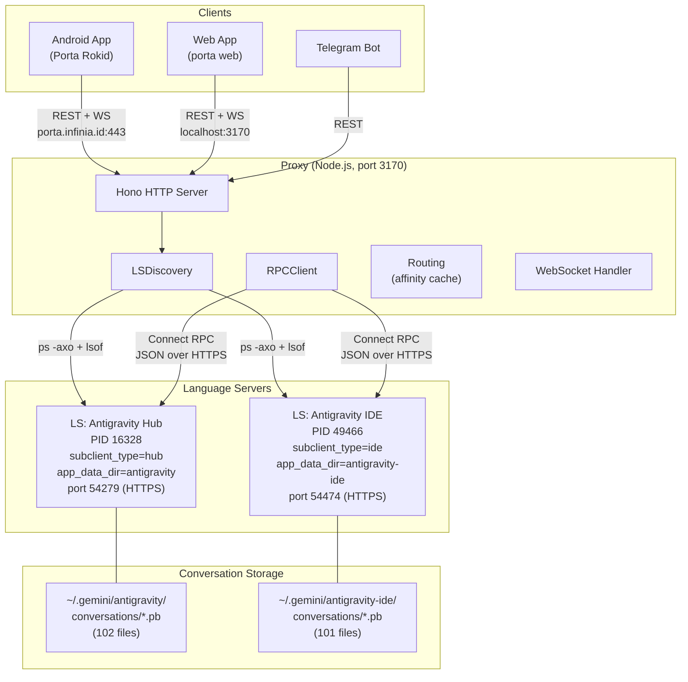
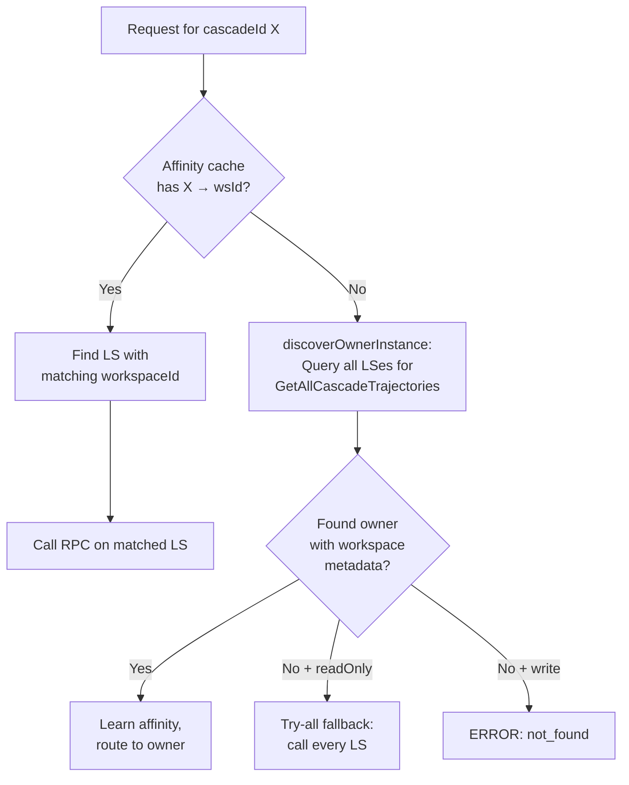

# Porta ↔ LSP Communication Architecture Analysis

## Architecture Overview



---

## Two Language Server Instances

### Antigravity Hub (2.0 Standalone)
| Property | Value |
|----------|-------|
| **Executable** | `/Applications/Antigravity.app/.../language_server` |
| **PID** | 16328 |
| **Flags** | `--standalone --subclient_type hub` |
| **app_data_dir** | `antigravity` |
| **Conversations dir** | `~/.gemini/antigravity/conversations/` |
| **HTTPS Port** | 54279 (dynamically assigned) |
| **CSRF Token** | `db2d540a-57fd-459a-bf48-fb14641af2c5` |
| **Workspace** | **None** (no `--workspace_id`; `GetWorkspaceInfos` returns home dir only) |
| **Cloud Endpoint** | `daily-cloudcode-pa.googleapis.com` |
| **API Server** | `generativelanguage.googleapis.com` |
| **Loaded conversations** | **110** (all from disk) |

### Antigravity IDE
| Property | Value |
|----------|-------|
| **Executable** | `/Applications/Antigravity IDE.app/.../language_server_macos_arm` |
| **PID** | 49466 |
| **Flags** | `--enable_lsp --subclient_type ide` |
| **app_data_dir** | `antigravity-ide` |
| **Conversations dir** | `~/.gemini/antigravity-ide/conversations/` |
| **HTTPS Port** | 54474 (dynamically assigned) |
| **CSRF Token** | `74a5caee-e473-4106-ac95-2612c2ab7bec` |
| **Workspace** | `file_Volumes_980PRO_Users_iwan_porta` (porta project) |
| **Cloud Endpoint** | `cloudcode-pa.googleapis.com` (production) |
| **Loaded conversations** | **0** in-memory (101 on disk) |

> [!IMPORTANT]
> Meskipun binary LS-nya berbeda (`language_server` vs `language_server_macos_arm`), keduanya mengekspos **proto service yang sama**: `exa.language_server_pb.LanguageServerService`, dengan RPC methods identik.

---

## Protocol: Connect RPC (JSON over HTTPS)

Komunikasi Proxy → LS menggunakan **Connect RPC** — yaitu JSON over HTTP POST ke self-signed HTTPS.

```
POST https://127.0.0.1:{port}/exa.language_server_pb.LanguageServerService/{Method}
Headers:
  Content-Type: application/json
  x-codeium-csrf-token: {csrf_token}
Body: JSON object (protobuf field names)
```

### Key RPC Methods

| Method | Purpose | Request Fields |
|--------|---------|---------------|
| `GetWorkspaceInfos` | Get LS workspace info | `{}` |
| `GetAllCascadeTrajectories` | List all conversations | `{}` |
| `StartCascade` | Create new conversation | `source`, `metadata`, `workspaceFolderAbsoluteUri` |
| `SendUserCascadeMessage` | Send user message | `cascadeId`, `items`, `cascadeConfig`, `metadata` |
| `GetCascadeTrajectory` | Get conversation details | `cascadeId` |
| `GetCascadeTrajectorySteps` | Get conversation steps | `cascadeId`, `stepOffset` |
| `CancelCascadeInvocation` | Stop agent | `cascadeId` |
| `DeleteCascadeTrajectory` | Delete conversation | `cascadeId`, `metadata` |
| `RevertToCascadeStep` | Revert to step | `cascadeId`, `stepIndex`, `metadata` |
| `HandleCascadeUserInteraction` | Approve/reject actions | `cascadeId`, `interaction` |

### Metadata Object (sent by Proxy as `ideName: "porta"`)
```json
{
  "ideName": "porta",
  "ideVersion": "0.1.0",
  "extensionVersion": "0.1.0",
  "allowFileAccess": true,
  "allWorkspaceTrustGranted": true
}
```

### StartCascade Source Enum
```
CORTEX_TRAJECTORY_SOURCE_UNKNOWN = 0
CORTEX_TRAJECTORY_SOURCE_CHAT = 1    ← Porta default
```

---

## Conversation Storage & Overlap

```
Hub  dir: ~/.gemini/antigravity/conversations/       → 102 .pb files
IDE  dir: ~/.gemini/antigravity-ide/conversations/    → 101 .pb files
                                                         ↕
                                               100 shared (.pb files identical UUIDs)
                                               2 Hub-only
                                               1 IDE-only
```

> [!WARNING]
> **100 dari 101 IDE conversations juga ada di Hub!** Ini karena conversations di-sync/copy antar `app_data_dir`. Tanpa field pembeda di dalam `.pb` file, tidak mungkin mengetahui apakah conversation **berasal** dari Hub atau IDE.

---

## Discovery: Mengapa Proxy Hanya Menemukan Hub LS

Current proxy discovery:
1. Scan `~/.gemini/antigravity/daemon/ls_*.json` → hanya `ls_mock.json` (fake)
2. `ps -axo pid=,args=` → finds both PIDs (16328 & 49466)
3. Parse `--csrf_token`, `--server_port` (⚠️ bukan `--https_server_port`)
4. Untuk PID tanpa `httpsPort`, run `lsof -nP -iTCP -sTCP:LISTEN -a -p {PID}` dan probe setiap port

**Masalah IDE LS:**
- PID 49466 tidak punya `--server_port` atau `--https_server_port`
- `lsof` menemukan 3 port: 54474, 54475, 54498
- Proxy probe semua port via Connect RPC → **port 54474 responds** ✅
- **Tapi**: Proxy CSRF token parsed dari `--csrf_token 74a5caee...` dan port dari `lsof`

**Status saat ini**: Proxy menemukan **hanya Hub LS** (PID 16328). IDE LS (PID 49466) **kadang ditemukan, kadang tidak** tergantung timing dan cache.

---

## Routing: Conversation → LS Instance



Key insight: **Conversations tanpa workspace metadata** (mis. Hub conversations yang dibuat tanpa project context) **tidak bisa di-route secara deterministik** ke LS tertentu.

---

## Bisa Dibuat Distinct? — Strategi

### 1. **Distinguish by `app_data_dir`** ✅ Feasible

Setiap LS punya `--app_data_dir` yang berbeda:
- Hub: `antigravity`
- IDE: `antigravity-ide`

**Tapi**: field ini **tidak ada di dalam .pb file** atau conversation summary. Hanya accessible dari command-line args pada saat discovery.

**Solusi proxy-side**: Enrich `LSInstance` dengan `appDataDir` field saat discovery, lalu annotate setiap conversation summary dengan `_source: "hub" | "ide"`.

### 2. **Distinguish by `subclient_type`** ✅ Feasible

- Hub: `--subclient_type hub`
- IDE: `--subclient_type ide`

Sama seperti #1 — bisa di-parse dari process args dan di-inject ke conversation metadata.

### 3. **Distinguish by workspace** ⚠️ Partial

- IDE LS selalu punya `--workspace_id` (terikat ke satu project)
- Hub LS **tidak punya** workspace — melayani semua workspace

Conversations yang punya `workspaceFolderAbsoluteUri` matching IDE workspace → **likely dari IDE**. Tapi ini heuristic, bukan definitif.

### 4. **Distinguish by conversation directory** ✅ Most Reliable

```
Hub  conversations: ~/.gemini/antigravity/conversations/*.pb
IDE  conversations: ~/.gemini/antigravity-ide/conversations/*.pb
```

Conversations yang ada di salah satu dir tapi tidak di yang lain → definitif.
Yang overlap (100 files) → tidak bisa dibedakan tanpa inspect .pb content.

### 5. **Distinguish via separate proxy scan** ✅ Clean Solution

Modifikasi `scanDiskConversations()` agar scan **kedua** directories:
```typescript
// Scan both app_data_dirs
const hubIds = await scanDir("~/.gemini/antigravity/conversations/");
const ideIds = await scanDir("~/.gemini/antigravity-ide/conversations/");

// Annotate
for (const id of hubIds) merged[id]._appDataDir = "antigravity";
for (const id of ideIds) merged[id]._appDataDir = "antigravity-ide";
// If present in both → prefer the one loaded by the matching LS
```

---

## Recommended Implementation

> [!TIP]
> The cleanest approach is a combination of **discovery enrichment** + **disk scan separation**.

### Phase 1: Enrich LSInstance at Discovery
Add `appDataDir` and `subclientType` to `LSInstance` by parsing command-line args:

```typescript
// In parsePsCandidates / parseCommandCandidate
appDataDir: parseArgValue(args, "--app_data_dir"),
subclientType: parseArgValue(args, "--subclient_type"),
```

### Phase 2: Annotate Conversations in API Response
In `/api/conversations`, annotate each conversation with which LS/client it came from:

```typescript
merged[id]._source = inst.subclientType ?? "unknown";  // "hub" | "ide"
merged[id]._appDataDir = inst.appDataDir ?? "unknown";
```

### Phase 3: Android App Filter
Add UI filter in Android app to show/hide by source:
- "All" | "Hub" | "IDE" | "Porta"

### Phase 4: Separate Conversation Directories
Long-term: configure proxy to scan per-LS conversation dirs based on `appDataDir`, eliminating overlap ambiguity entirely.

---

## Open Questions

> [!IMPORTANT]
> 1. **Apakah kamu ingin saya implementasikan Phase 1-3?** (Ini akan membuat conversations di Android app bisa di-filter berdasarkan sumber: Hub vs IDE)
> 2. **Apakah conversations yang overlap (100 files) harus ditampilkan sekali atau dua kali?** (Rekomendasi: sekali, dengan preference ke LS yang sedang running)
> 3. **Apakah Porta Android juga perlu bisa membuat conversations yang secara eksplisit terikat ke Hub atau IDE?** (Saat ini semua conversations baru dari Porta dikirim ke LS pertama yang ditemukan)
