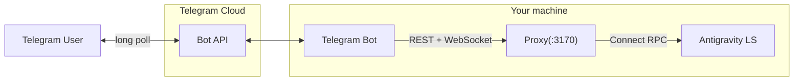

# Telegram Bot Bridge

Porta includes an optional Telegram bot that bridges Antigravity
conversations to Telegram. It runs as a separate process alongside the
proxy and web UI.



The bot communicates with the proxy via the same REST API and WebSocket
endpoints that the web UI uses. This means all proxy features work out
of the box: authentication, routing, step recovery, compression.

## Prerequisites

- Everything from the [Quick start](../README.md#quick-start)
  (Node.js ≥ 22, pnpm ≥ 10, running Antigravity instance)
- A **Telegram account**
- A **Telegram Bot Token** from [@BotFather](https://t.me/BotFather)

## Setup

### Step 1: Create a Telegram bot

1. Open Telegram and search for [@BotFather](https://t.me/BotFather)
2. Send `/newbot`
3. Follow the prompts to choose a name and username
4. Copy the **HTTP API token** that BotFather gives you

> **Example token:** `7123456789:AAH_xxxxxxxxxxxxxxxxxxxxxxxxxxxx`  
> Keep this token secret — anyone with it can control your bot.

### Step 2: Get your Telegram user ID

You need your numeric Telegram user ID to authorize yourself:

1. Open Telegram and search for [@userinfobot](https://t.me/userinfobot)
2. Send any message to it
3. It will reply with your user ID (a number like `123456789`)

> **For multiple users:** repeat this for each person who should have
> access. You can also add group IDs for group chat access.

### Step 3: Configure `.env`

Add the following to your `.env` file in the repo root:

```bash
# ── Telegram Bot ──
TELEGRAM_BOT_TOKEN=7123456789:AAH_xxxxxxxxxxxxxxxxxxxxxxxxxxxx
TELEGRAM_ALLOWED_USERS=123456789
```

Or to allow multiple users:

```bash
TELEGRAM_ALLOWED_USERS=123456789,987654321,111222333
```

### Step 4: Install dependencies

If you haven't already, install all packages:

```bash
pnpm install
```

### Step 5: Start

You have two options:

**Option A: Start everything together** (recommended)

```bash
pnpm dev
```

When `TELEGRAM_BOT_TOKEN` is set, `pnpm dev` automatically starts the
Telegram bot alongside the proxy and web UI. Logs go to
`logs/telegram.log`.

**Option B: Start the bot separately**

If the proxy is already running, you can start only the bot:

```bash
pnpm dev:telegram
```

The bot will connect to the proxy at `PORTA_HOST:PORTA_PORT`
(default: `127.0.0.1:3170`).

### Step 6: Verify

Open Telegram and send `/start` to your bot. You should see a welcome
message with a list of available commands. If you get no response, check
`logs/telegram.log` for errors.

## Configuration reference

All settings go in `.env` in the repo root.

| Variable | Required | Default | Description |
|---|---|---|---|
| `TELEGRAM_BOT_TOKEN` | **Yes** | — | Bot token from @BotFather |
| `TELEGRAM_ALLOWED_USERS` | **Yes** | — | Comma-separated list of allowed Telegram user IDs |
| `TELEGRAM_ALLOWED_GROUPS` | No | *(empty)* | Comma-separated list of allowed group/supergroup IDs |
| `TELEGRAM_WORKSPACE_URI` | No | *(auto)* | Default workspace URI for new conversations |

The bot also reads these proxy settings:

| Variable | Used for |
|---|---|
| `PORTA_HOST` | Proxy hostname to connect to |
| `PORTA_PORT` | Proxy port to connect to |
| `PORTA_AUTH_TOKEN` | Bearer token for proxy authentication |

## Security

The bot enforces a strict whitelist model:

| Chat type | Requirement |
|---|---|
| Private chat | User ID must be in `TELEGRAM_ALLOWED_USERS` |
| Group chat | Group ID must be in `TELEGRAM_ALLOWED_GROUPS` **AND** user must be in `TELEGRAM_ALLOWED_USERS` |
| Unknown user | Rejected with "⛔ Access Denied" message |
| Unknown group | Silently ignored (no response) |
| Channel | Silently ignored |

The bot authenticates to the proxy using `PORTA_AUTH_TOKEN`, the same
token used by the web UI. You **must** set this in `.env` if you have
authentication enabled — which you should.

> **Important:** Never share your `TELEGRAM_BOT_TOKEN`. Anyone with this
> token can impersonate your bot. If compromised, revoke it via
> @BotFather (`/revoke`).

## Commands

| Command | Description |
|---|---|
| `/start` | Welcome message and command list |
| `/new` | Create a new conversation |
| `/list` | Show the 10 most recent conversations |
| `/use <id>` | Switch to an existing conversation (8-char prefix is enough) |
| `/model <name>` | Select a model (e.g. `/model gemini-2.5-pro`) |
| `/models` | List available models from the Language Server |
| `/model` | Reset to default model |
| `/stop` | Stop a running agent |
| `/end` | End the current session |
| `/status` | Show proxy and Language Server status |
| `/help` | Show help |

### Free-text messages

Any text message (not a command) is forwarded to Antigravity as a user
message. If no conversation session exists, one is automatically created.

### Photo messages

Send a photo with a caption to include an image in your message. The bot
downloads the photo at the highest available resolution, encodes it as
base64, and sends it alongside your caption to Antigravity.

This is useful for sending screenshots, diagrams, or UI mockups — for
example, sending a screenshot with the caption "fix this layout bug".

### Approval flow

When Antigravity needs permission to run a command or access a file, the
bot shows inline keyboard buttons:

```
⚡ Command Approval Required

`rm -rf node_modules && npm install`

[✅ Approve]  [❌ Reject]
```

Tap **Approve** to allow the action, or **Reject** to deny it.

> **Tip:** If you want all actions to be auto-approved without
> interactive buttons, set `PORTA_AUTO_APPROVE=true` in `.env`. This is
> the default behavior.

## Streaming

Responses from Antigravity are streamed in real-time via WebSocket. The
bot batches updates every 1.5 seconds and edits the last message using
Telegram's `editMessageText` API.

When a response exceeds Telegram's 4096-character limit, it's
automatically split across multiple messages.

For tasks that take longer than 30 seconds, the bot sends a proactive
notification when the agent finishes:

```
✅ Task selesai (2m 15s)
```

## Troubleshooting

### Bot not responding

1. Check `logs/telegram.log` for errors
2. Verify `TELEGRAM_BOT_TOKEN` is correct
3. Verify `TELEGRAM_ALLOWED_USERS` contains your user ID
4. Make sure the proxy is running (`pnpm dev` or proxy started separately)

### "Proxy tidak terjangkau" error

The bot can't reach the Porta proxy. Check:
- The proxy is running on the configured `PORTA_HOST:PORTA_PORT`
- `PORTA_AUTH_TOKEN` in `.env` matches what the proxy expects

### "No Language Server found" error

Antigravity is not running. Start Antigravity first, then the proxy
will discover it automatically.

### Messages not streaming

If you see the initial response but no streaming updates:
- Check the proxy logs for WebSocket errors
- The proxy must support WebSocket connections (it does by default)
- Restart the bot with `/end` then send a new message

### Getting your group ID

To find a Telegram group's ID:
1. Add [@userinfobot](https://t.me/userinfobot) to the group
2. It will print the group's ID (a negative number like `-1001234567890`)
3. Add this ID to `TELEGRAM_ALLOWED_GROUPS` in `.env`
4. Remove @userinfobot from the group
